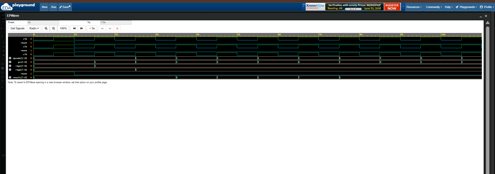

# 🧠💻 Mini CPU Design Using Verilog HDL 🚀🏆

An 8-bit Mini CPU designed using Verilog HDL capable of executing a sequence of instructions through instruction fetch, decode, and execution stages. This project demonstrates the fundamental architecture of a processor and serves as a strong foundation for understanding CPU design concepts.

---

## ✨ Features

✅ 8-bit CPU Architecture

✅ Program Counter (PC)

✅ Instruction Memory

✅ Register A and Register B

✅ Arithmetic Logic Unit (ALU)

✅ Instruction Decoder

✅ Automatic Program Execution

✅ RTL Simulation using EDA Playground

✅ Waveform Verification using EPWave

---

## 🛠️ Supported Instructions

| Opcode | Instruction | Operation |
|----------|-------------|------------|
| 000 | LOADA | Load immediate value into Register A |
| 001 | LOADB | Load immediate value into Register B |
| 010 | ADD | A + B |
| 011 | SUB | A − B |
| 100 | AND | A AND B |
| 101 | OR | A OR B |
| 110 | XOR | A XOR B |
| 111 | NOP | No Operation |

---

## ⚙️ Program Executed

```text
LOADA 5
LOADB 3
ADD
SUB
AND
OR
XOR
NOP
```

---

## 📊 Expected Results

| Instruction | Result |
|-------------|----------|
| LOADA 5 | regA = 5 |
| LOADB 3 | regB = 3 |
| ADD | 8 |
| SUB | 2 |
| AND | 1 |
| OR | 7 |
| XOR | 6 |
| NOP | 6 |

---

## 📸 Waveform Verification



The waveform confirms successful execution of all instructions and validates the functionality of the Mini CPU.

---

## 🧪 Simulation Tools

- Verilog HDL
- EDA Playground
- EPWave

---

## 🎯 Learning Outcomes

Through this project, I gained practical understanding of:

- CPU Architecture
- Program Counters
- Instruction Fetch & Decode
- ALU Design
- Register Operations
- Sequential Logic Design
- RTL Verification Techniques

---

## 👩‍💻 Author

**Aneesa Pattan**

Final Year Electronics and Communication Engineering (ECE) Student

Passionate about VLSI Design, Digital Design, Embedded Systems, and Hardware Development.

---

⭐ If you found this project interesting, feel free to star the repository!
